# LoadRunner

## 介绍

LoadRunner用于软件的负载测试。通过模拟多个用户实施并发负载及实时性能检测的方式来确认和查找问题。使用LoadRunner能够最大限度地缩短测试时间，优化性能，缩短应用系统的发布周期。LoadRunner，可适用于各种体系架构的自动负载测试，能预测系统行为并评估系统性能。


## LoadRunner的组成

loadrunner是一个套件，是由多个子工具组成的

主要有三大组件


### virtual user generator

虚拟用户脚本生成器，就是录制脚本、调试脚本的


### LoadRunner Controller

中央控制器，负责场景（运行的脚本、用户数量、运行逻辑等）设置和运行的


### LoadRunner Analysis

结果分析器，对性能测试的结果进行图表的分析，更加直观地展示测试数据


## 安装

### 1.下载

提供一个百度网盘地址：

```
链接: https://pan.baidu.com/s/1GoBIppL_tjydVjqQsxXlqA 提取码: ywgj 
```


也可以去官网下载，但是需要注册账号

[点击进入官网](https://sld.microfocus.com/mysoftware/download/downloadCenterForSelectedProducts?productLineId=LoadRunner&productId=1040258855)


下载完成后的文件


### 2.解压

解压后的目录

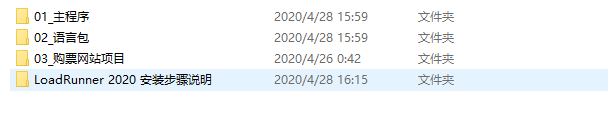


```sh
PS G:\百度网盘\LoadRunner 2020> ls


    目录: G:\百度网盘\LoadRunner 2020


Mode                 LastWriteTime         Length Name
----                 -------------         ------ ----
d-----         2020/4/28     15:59                01_主程序
d-----         2020/4/28     15:59                02_语言包
d-----         2020/4/26      0:42                03_购票网站项目
d-----         2020/4/28     16:15                LoadRunner 2020 安装步骤说明


PS G:\百度网盘\LoadRunner 2020> cd .\01_主程序\
PS G:\百度网盘\LoadRunner 2020\01_主程序> ls


    目录: G:\百度网盘\LoadRunner 2020\01_主程序


Mode                 LastWriteTime         Length Name
----                 -------------         ------ ----
-a----         2020/4/27     16:00     1030451544 LoadRunner_2020_Community_Edition.exe


PS G:\百度网盘\LoadRunner 2020\01_主程序> cd ..
PS G:\百度网盘\LoadRunner 2020> cd .\02_语言包\
PS G:\百度网盘\LoadRunner 2020\02_语言包> ls


    目录: G:\百度网盘\LoadRunner 2020\02_语言包


Mode                 LastWriteTime         Length Name
----                 -------------         ------ ----
-a----         2020/4/27     16:25      875860920 LoadRunner_2020_Community_Edition_Language_Packs.exe


PS G:\百度网盘\LoadRunner 2020\02_语言包> cd ..
PS G:\百度网盘\LoadRunner 2020> cd .\03_购票网站项目\
PS G:\百度网盘\LoadRunner 2020\03_购票网站项目> ls


    目录: G:\百度网盘\LoadRunner 2020\03_购票网站项目


Mode                 LastWriteTime         Length Name
----                 -------------         ------ ----
d-----         2020/4/26      0:42                Web Tours Sample Application
-a----         2019/3/30     12:22       38594004 Web Tours Sample Application.zip


PS G:\百度网盘\LoadRunner 2020\03_购票网站项目> cd '.\Web Tours Sample Application\'
PS G:\百度网盘\LoadRunner 2020\03_购票网站项目\Web Tours Sample Application> ls


    目录: G:\百度网盘\LoadRunner 2020\03_购票网站项目\Web Tours Sample Application


Mode                 LastWriteTime         Length Name
----                 -------------         ------ ----
d-----         2020/4/26      0:42                WebTours
-a----          2017/8/6      5:52       33731332 strawberry-perl-5.10.1.0.msi
-a----          2017/8/6      5:52        6447504 WebTours.zip


PS G:\百度网盘\LoadRunner 2020\03_购票网站项目\Web Tours Sample Application> cd .\WebTours\
PS G:\百度网盘\LoadRunner 2020\03_购票网站项目\Web Tours Sample Application\WebTours> ls


    目录: G:\百度网盘\LoadRunner 2020\03_购票网站项目\Web Tours Sample Application\WebTours


Mode                 LastWriteTime         Length Name
----                 -------------         ------ ----
d-----         2020/4/26      0:42                bin
d-----         2020/4/26      0:42                cgi-bin
d-----         2020/4/26      0:42                conf
d-----         2020/4/26      0:42                error
d-----         2020/4/26      0:42                htdocs
d-----         2020/4/26      0:42                icons
d-----         2020/4/26      0:42                logs
d-----         2020/4/26      0:42                manual
d-----         2020/4/26      0:42                modules
d-----         2020/4/26      0:42                templates
-a----        2004/11/21     18:50          15159 ABOUT_APACHE.txt
-a----          2011/9/9     14:31         121134 CHANGES.txt
-a----         2016/4/21      3:26          17824 GetLRPath.exe
-a----         2008/9/18     19:16           4835 INSTALL.txt
-a----          2011/9/9     17:12          36833 LICENSE.txt
-a----         2016/4/21      3:26         316832 mercuryproducts.dll
-a----          2011/9/9     17:12           1323 NOTICE.txt
-a----         2012/1/12     21:22              0 README
-a----        2008/10/15     14:22           1650 README-win32.txt
-a----         2007/1/10      5:50           6094 README.txt
-a----         2014/3/10     22:32            127 StartServer.bat


PS G:\百度网盘\LoadRunner 2020\03_购票网站项目\Web Tours Sample Application\WebTours> cd bin
PS G:\百度网盘\LoadRunner 2020\03_购票网站项目\Web Tours Sample Application\WebTours\bin> ls


    目录: G:\百度网盘\LoadRunner 2020\03_购票网站项目\Web Tours Sample Application\WebTours\bin


Mode                 LastWriteTime         Length Name
----                 -------------         ------ ----
d-----         2020/4/26      0:42                iconv
-a----          2011/9/9     16:26          81994 ab.exe
-a----          2011/9/9     16:27          41051 ApacheMonitor.exe
-a----          2011/9/9     16:26          28771 apr_dbd_mysql-1.dll
-a----          2011/9/9     16:25          28770 apr_dbd_odbc-1.dll
-a----          2011/9/9     16:26          32868 apr_dbd_oracle-1.dll
-a----          2011/9/9     16:26          28771 apr_dbd_pgsql-1.dll
-a----         2012/1/16      8:28          28773 apr_dbd_sqlite3-1.dll
-a----          2011/9/9     16:26          24672 apr_dbm_db-1.dll
-a----         2012/1/22     10:13          24671 apr_ldap-1.dll
-a----         2012/1/16      8:28           9192 dbmmanage.pl
-a----          2011/9/9     16:27          61524 htcacheclean.exe
-a----          2011/9/9     16:27          86093 htdbm.exe
-a----          2011/9/9     16:27          73808 htdigest.exe
-a----          2011/9/9     16:27          82000 htpasswd.exe
-a----          2011/9/9     16:26          20549 httpd.exe
-a----          2011/9/9     16:27          57425 httxt2dbm.exe
-a----          2011/9/9     16:24         139347 libapr-1.dll
-a----          2011/9/9     16:24          36958 libapriconv-1.dll
-a----          2011/9/9     16:25         192604 libaprutil-1.dll
-a----          2011/9/9     16:26         274504 libhttpd.dll
-a----          2011/9/9     16:27          20562 logresolve.exe
-a----          2011/9/9     16:27          53330 rotatelogs.exe
-a----          2011/9/9     16:27          20564 wintty.exe
-a----         2010/3/15      2:52          77876 zlib1.dll


PS G:\百度网盘\LoadRunner 2020\03_购票网站项目\Web Tours Sample Application\WebTours\bin> cd ./../../../
PS G:\百度网盘\LoadRunner 2020\03_购票网站项目> cd ..
PS G:\百度网盘\LoadRunner 2020> cd '.\LoadRunner 2020 安装步骤说明\'
PS G:\百度网盘\LoadRunner 2020\LoadRunner 2020 安装步骤说明> ls


    目录: G:\百度网盘\LoadRunner 2020\LoadRunner 2020 安装步骤说明


Mode                 LastWriteTime         Length Name
----                 -------------         ------ ----
d-----         2020/4/28     16:15                01_主程序安装步骤
d-----         2020/4/28     16:15                02_汉化步骤
-a----         2020/4/28     16:15             34 说明.txt


PS G:\百度网盘\LoadRunner 2020\LoadRunner 2020 安装步骤说明>
```


### 3.双击安装主程序


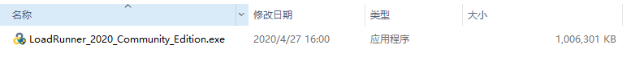


### 4.选择安装位置


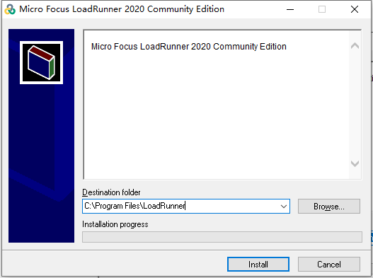


### 5.点击安装

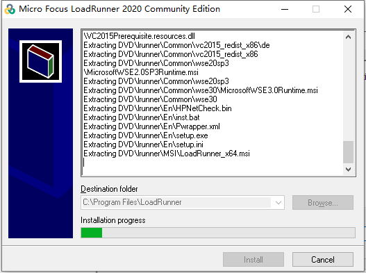


### 6.确认软件依赖环境


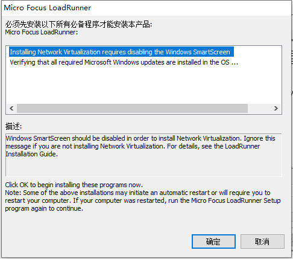


### 7.点击确定

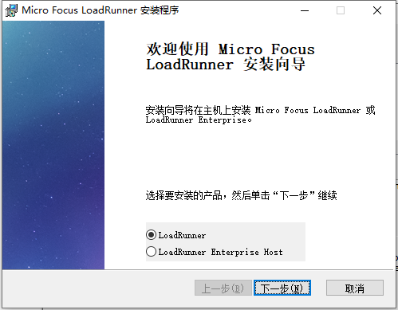


### 8.同意协议


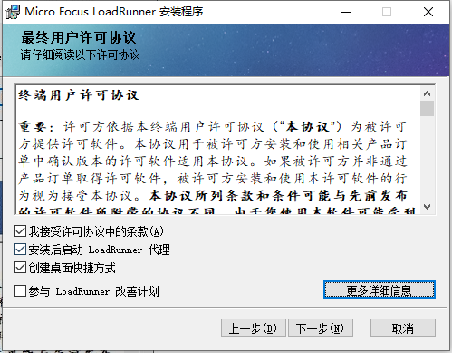


### 9.更改软件安装位置


路径中不要包含中文信息


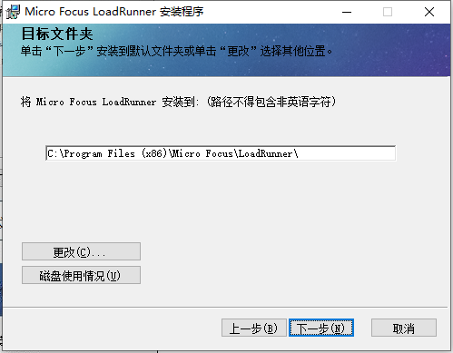


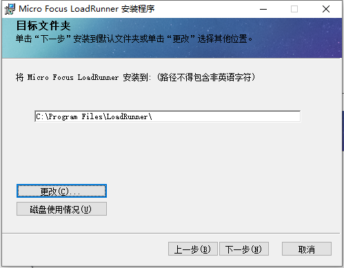


### 10.点击安装


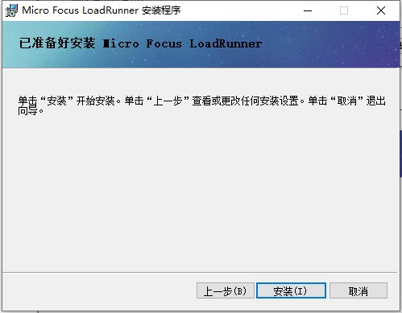


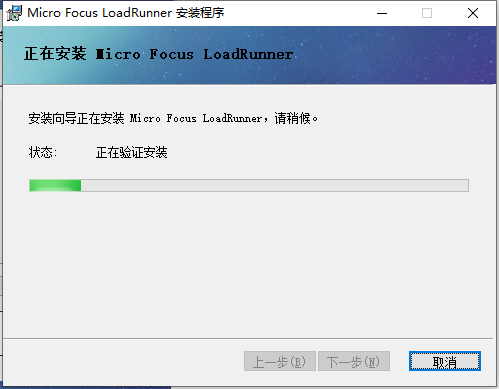


### 11.允许防火墙访问


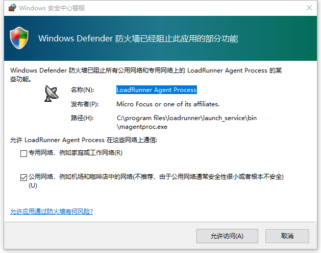


### 12.取消勾选身份认证按钮


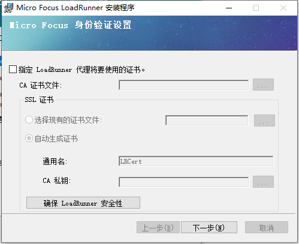


点击下一步

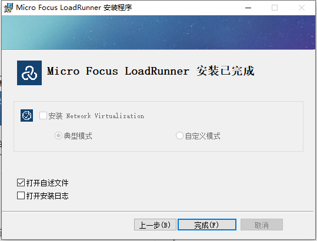


### 13.在开始菜单中找到LoadRunner License Utility


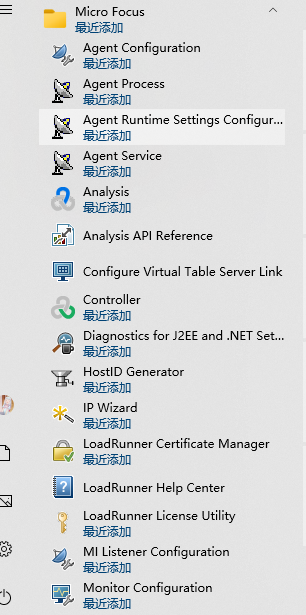


### 14.打开LoadRunner License Utility


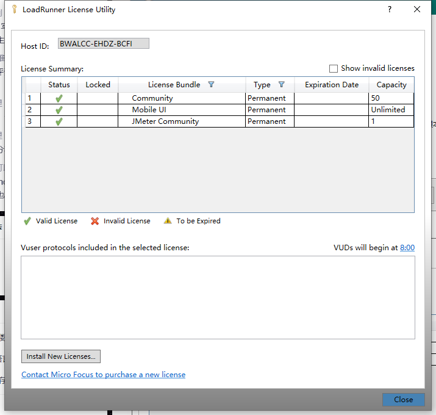


LoadRunner 默认安装即已经激活社区版许可，如果3个都是绿色的勾，则安装完成


## 汉化

### 1.双击汉化程序


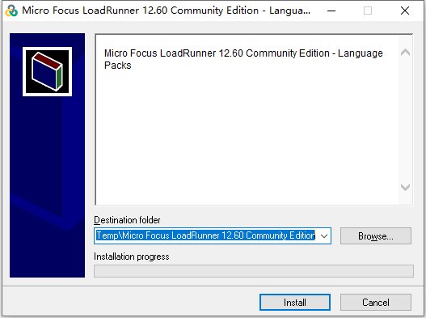


### 2.选择安装位置


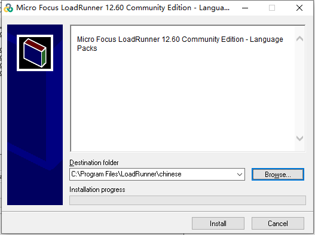


### 3.点击安装


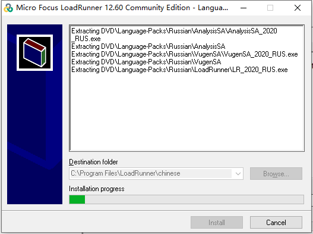


### 4.打开安装目录所在的文件夹


### 5.找到LR_2020_CHS


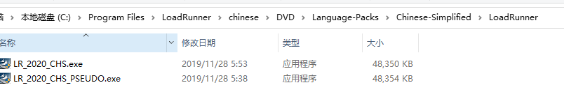


路径：.\DVD\Language-Packs\Chinese-Simplified\LoadRunner


### 6.双击程序


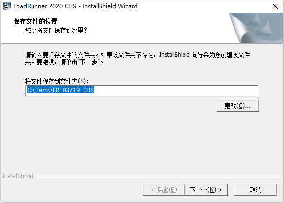


### 7.选择安装位置


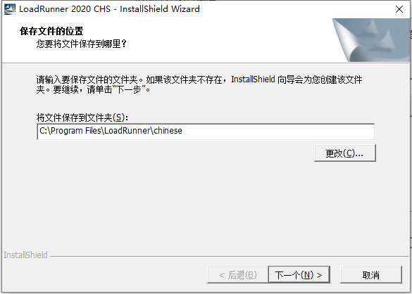


### 8.安装

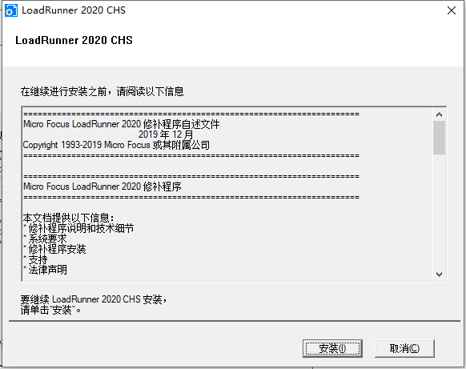


### 9.重新启动

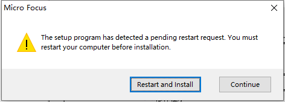


### 10.点击setup安装


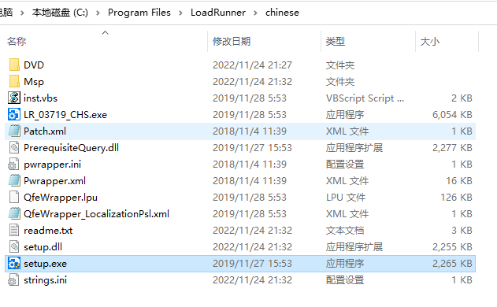


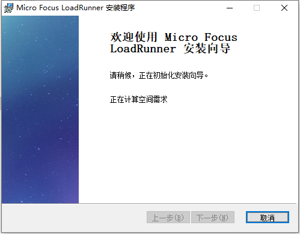

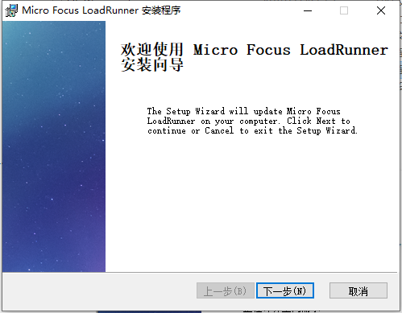


### 11.更新

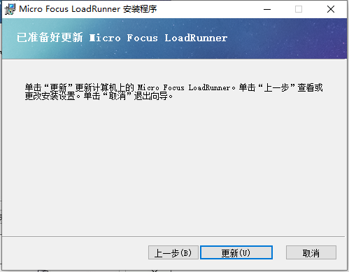


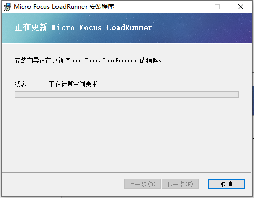


### 12.汉化完成

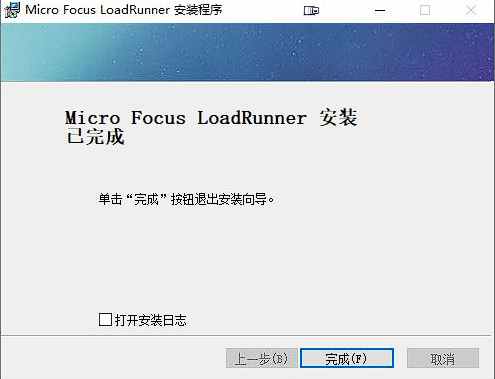


## WebTours

