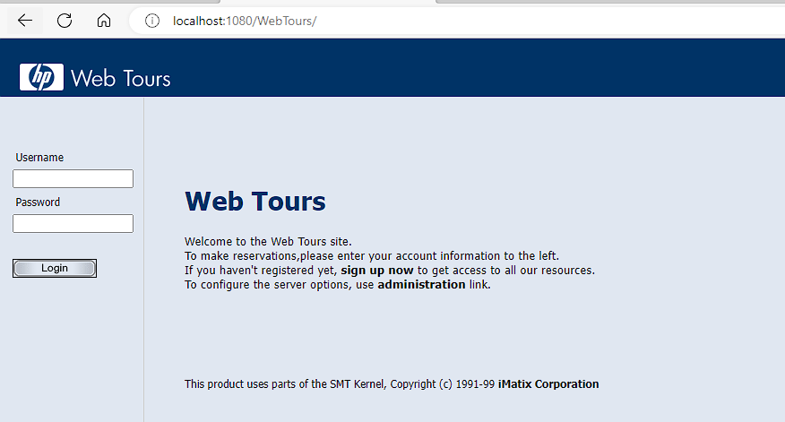
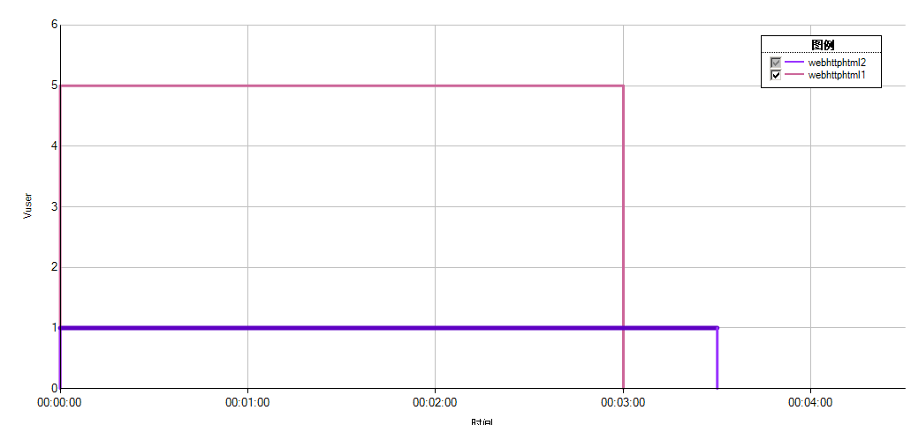

# LoadRunner

## 介绍

LoadRunner用于软件的负载测试。通过模拟多个用户实施并发负载及实时性能检测的方式来确认和查找问题。使用LoadRunner能够最大限度地缩短测试时间，优化性能，缩短应用系统的发布周期。LoadRunner，可适用于各种体系架构的自动负载测试，能预测系统行为并评估系统性能。


## LoadRunner的组成

loadrunner是一个套件，是由多个子工具组成的

主要有三大组件


### virtual user generator

虚拟用户脚本生成器，就是录制脚本、调试脚本的


### LoadRunner Controller

中央控制器，负责场景（运行的脚本、用户数量、运行逻辑等）设置和运行的


### LoadRunner Analysis

结果分析器，对性能测试的结果进行图表的分析，更加直观地展示测试数据


## 安装

### 1.下载

提供一个百度网盘地址：

```
链接: https://pan.baidu.com/s/1GoBIppL_tjydVjqQsxXlqA 提取码: ywgj 
```


也可以去官网下载，但是需要注册账号

[点击进入官网](https://sld.microfocus.com/mysoftware/download/downloadCenterForSelectedProducts?productLineId=LoadRunner&productId=1040258855)


下载完成后的文件


### 2.解压

解压后的目录


```sh
PS G:\百度网盘\LoadRunner 2020> ls


    目录: G:\百度网盘\LoadRunner 2020


Mode                 LastWriteTime         Length Name
----                 -------------         ------ ----
d-----         2020/4/28     15:59                01_主程序
d-----         2020/4/28     15:59                02_语言包
d-----         2020/4/26      0:42                03_购票网站项目
d-----         2020/4/28     16:15                LoadRunner 2020 安装步骤说明


PS G:\百度网盘\LoadRunner 2020> cd .\01_主程序\
PS G:\百度网盘\LoadRunner 2020\01_主程序> ls


    目录: G:\百度网盘\LoadRunner 2020\01_主程序


Mode                 LastWriteTime         Length Name
----                 -------------         ------ ----
-a----         2020/4/27     16:00     1030451544 LoadRunner_2020_Community_Edition.exe


PS G:\百度网盘\LoadRunner 2020\01_主程序> cd ..
PS G:\百度网盘\LoadRunner 2020> cd .\02_语言包\
PS G:\百度网盘\LoadRunner 2020\02_语言包> ls


    目录: G:\百度网盘\LoadRunner 2020\02_语言包


Mode                 LastWriteTime         Length Name
----                 -------------         ------ ----
-a----         2020/4/27     16:25      875860920 LoadRunner_2020_Community_Edition_Language_Packs.exe


PS G:\百度网盘\LoadRunner 2020\02_语言包> cd ..
PS G:\百度网盘\LoadRunner 2020> cd .\03_购票网站项目\
PS G:\百度网盘\LoadRunner 2020\03_购票网站项目> ls


    目录: G:\百度网盘\LoadRunner 2020\03_购票网站项目


Mode                 LastWriteTime         Length Name
----                 -------------         ------ ----
d-----         2020/4/26      0:42                Web Tours Sample Application
-a----         2019/3/30     12:22       38594004 Web Tours Sample Application.zip


PS G:\百度网盘\LoadRunner 2020\03_购票网站项目> cd '.\Web Tours Sample Application\'
PS G:\百度网盘\LoadRunner 2020\03_购票网站项目\Web Tours Sample Application> ls


    目录: G:\百度网盘\LoadRunner 2020\03_购票网站项目\Web Tours Sample Application


Mode                 LastWriteTime         Length Name
----                 -------------         ------ ----
d-----         2020/4/26      0:42                WebTours
-a----          2017/8/6      5:52       33731332 strawberry-perl-5.10.1.0.msi
-a----          2017/8/6      5:52        6447504 WebTours.zip


PS G:\百度网盘\LoadRunner 2020\03_购票网站项目\Web Tours Sample Application> cd .\WebTours\
PS G:\百度网盘\LoadRunner 2020\03_购票网站项目\Web Tours Sample Application\WebTours> ls


    目录: G:\百度网盘\LoadRunner 2020\03_购票网站项目\Web Tours Sample Application\WebTours


Mode                 LastWriteTime         Length Name
----                 -------------         ------ ----
d-----         2020/4/26      0:42                bin
d-----         2020/4/26      0:42                cgi-bin
d-----         2020/4/26      0:42                conf
d-----         2020/4/26      0:42                error
d-----         2020/4/26      0:42                htdocs
d-----         2020/4/26      0:42                icons
d-----         2020/4/26      0:42                logs
d-----         2020/4/26      0:42                manual
d-----         2020/4/26      0:42                modules
d-----         2020/4/26      0:42                templates
-a----        2004/11/21     18:50          15159 ABOUT_APACHE.txt
-a----          2011/9/9     14:31         121134 CHANGES.txt
-a----         2016/4/21      3:26          17824 GetLRPath.exe
-a----         2008/9/18     19:16           4835 INSTALL.txt
-a----          2011/9/9     17:12          36833 LICENSE.txt
-a----         2016/4/21      3:26         316832 mercuryproducts.dll
-a----          2011/9/9     17:12           1323 NOTICE.txt
-a----         2012/1/12     21:22              0 README
-a----        2008/10/15     14:22           1650 README-win32.txt
-a----         2007/1/10      5:50           6094 README.txt
-a----         2014/3/10     22:32            127 StartServer.bat


PS G:\百度网盘\LoadRunner 2020\03_购票网站项目\Web Tours Sample Application\WebTours> cd bin
PS G:\百度网盘\LoadRunner 2020\03_购票网站项目\Web Tours Sample Application\WebTours\bin> ls


    目录: G:\百度网盘\LoadRunner 2020\03_购票网站项目\Web Tours Sample Application\WebTours\bin


Mode                 LastWriteTime         Length Name
----                 -------------         ------ ----
d-----         2020/4/26      0:42                iconv
-a----          2011/9/9     16:26          81994 ab.exe
-a----          2011/9/9     16:27          41051 ApacheMonitor.exe
-a----          2011/9/9     16:26          28771 apr_dbd_mysql-1.dll
-a----          2011/9/9     16:25          28770 apr_dbd_odbc-1.dll
-a----          2011/9/9     16:26          32868 apr_dbd_oracle-1.dll
-a----          2011/9/9     16:26          28771 apr_dbd_pgsql-1.dll
-a----         2012/1/16      8:28          28773 apr_dbd_sqlite3-1.dll
-a----          2011/9/9     16:26          24672 apr_dbm_db-1.dll
-a----         2012/1/22     10:13          24671 apr_ldap-1.dll
-a----         2012/1/16      8:28           9192 dbmmanage.pl
-a----          2011/9/9     16:27          61524 htcacheclean.exe
-a----          2011/9/9     16:27          86093 htdbm.exe
-a----          2011/9/9     16:27          73808 htdigest.exe
-a----          2011/9/9     16:27          82000 htpasswd.exe
-a----          2011/9/9     16:26          20549 httpd.exe
-a----          2011/9/9     16:27          57425 httxt2dbm.exe
-a----          2011/9/9     16:24         139347 libapr-1.dll
-a----          2011/9/9     16:24          36958 libapriconv-1.dll
-a----          2011/9/9     16:25         192604 libaprutil-1.dll
-a----          2011/9/9     16:26         274504 libhttpd.dll
-a----          2011/9/9     16:27          20562 logresolve.exe
-a----          2011/9/9     16:27          53330 rotatelogs.exe
-a----          2011/9/9     16:27          20564 wintty.exe
-a----         2010/3/15      2:52          77876 zlib1.dll


PS G:\百度网盘\LoadRunner 2020\03_购票网站项目\Web Tours Sample Application\WebTours\bin> cd ./../../../
PS G:\百度网盘\LoadRunner 2020\03_购票网站项目> cd ..
PS G:\百度网盘\LoadRunner 2020> cd '.\LoadRunner 2020 安装步骤说明\'
PS G:\百度网盘\LoadRunner 2020\LoadRunner 2020 安装步骤说明> ls


    目录: G:\百度网盘\LoadRunner 2020\LoadRunner 2020 安装步骤说明


Mode                 LastWriteTime         Length Name
----                 -------------         ------ ----
d-----         2020/4/28     16:15                01_主程序安装步骤
d-----         2020/4/28     16:15                02_汉化步骤
-a----         2020/4/28     16:15             34 说明.txt


PS G:\百度网盘\LoadRunner 2020\LoadRunner 2020 安装步骤说明>
```


### 3.双击安装主程序


### 4.选择安装位置


### 5.点击安装


### 6.确认软件依赖环境


### 7.点击确定


### 8.同意协议


### 9.更改软件安装位置


路径中不要包含中文信息


### 10.点击安装


### 11.允许防火墙访问


### 12.取消勾选身份认证按钮


点击下一步


### 13.在开始菜单中找到LoadRunner License Utility


### 14.打开LoadRunner License Utility


LoadRunner 默认安装即已经激活社区版许可，如果3个都是绿色的勾，则安装完成


## 汉化

### 1.双击汉化程序


### 2.选择安装位置


### 3.点击安装


### 4.打开安装目录所在的文件夹


### 5.找到LR_2020_CHS


路径：.\DVD\Language-Packs\Chinese-Simplified\LoadRunner


### 6.双击程序


### 7.选择安装位置


### 8.安装


### 9.重新启动


### 10.点击setup安装


### 11.更新


### 12.汉化完成


## WebTours

步骤：

1.找到WebTours目录

2.安装strawberry-perl-5.10.1.0

3.进入WebTours目录

4.找到StartServer.bat文件

5.启动StartServer.bat

6.访问


**安装strawberry-perl-5.10.1.0**


**启动StartServer.bat**

```sh
PS G:\百度网盘\LoadRunner 2020> ls


    目录: G:\百度网盘\LoadRunner 2020


Mode                 LastWriteTime         Length Name
----                 -------------         ------ ----
d-----         2020/4/28     15:59                01_主程序
d-----         2020/4/28     15:59                02_语言包
d-----         2020/4/26      0:42                03_购票网站项目
d-----         2020/4/28     16:15                LoadRunner 2020 安装步骤说明


PS G:\百度网盘\LoadRunner 2020> cd .\03_购票网站项目\
PS G:\百度网盘\LoadRunner 2020\03_购票网站项目> ls


    目录: G:\百度网盘\LoadRunner 2020\03_购票网站项目


Mode                 LastWriteTime         Length Name
----                 -------------         ------ ----
d-----         2020/4/26      0:42                Web Tours Sample Application
-a----         2019/3/30     12:22       38594004 Web Tours Sample Application.zip


PS G:\百度网盘\LoadRunner 2020\03_购票网站项目> cd '.\Web Tours Sample Application\'
PS G:\百度网盘\LoadRunner 2020\03_购票网站项目\Web Tours Sample Application> ls


    目录: G:\百度网盘\LoadRunner 2020\03_购票网站项目\Web Tours Sample Application


Mode                 LastWriteTime         Length Name
----                 -------------         ------ ----
d-----         2020/4/26      0:42                WebTours
-a----          2017/8/6      5:52       33731332 strawberry-perl-5.10.1.0.msi
-a----          2017/8/6      5:52        6447504 WebTours.zip


PS G:\百度网盘\LoadRunner 2020\03_购票网站项目\Web Tours Sample Application> cd .\WebTours\
PS G:\百度网盘\LoadRunner 2020\03_购票网站项目\Web Tours Sample Application\WebTours> ls


    目录: G:\百度网盘\LoadRunner 2020\03_购票网站项目\Web Tours Sample Application\WebTours


Mode                 LastWriteTime         Length Name
----                 -------------         ------ ----
d-----         2020/4/26      0:42                bin
d-----         2020/4/26      0:42                cgi-bin
d-----         2020/4/26      0:42                conf
d-----         2020/4/26      0:42                error
d-----         2020/4/26      0:42                htdocs
d-----         2020/4/26      0:42                icons
d-----         2020/4/26      0:42                logs
d-----         2020/4/26      0:42                manual
d-----         2020/4/26      0:42                modules
d-----         2020/4/26      0:42                templates
-a----        2004/11/21     18:50          15159 ABOUT_APACHE.txt
-a----          2011/9/9     14:31         121134 CHANGES.txt
-a----         2016/4/21      3:26          17824 GetLRPath.exe
-a----         2008/9/18     19:16           4835 INSTALL.txt
-a----          2011/9/9     17:12          36833 LICENSE.txt
-a----         2016/4/21      3:26         316832 mercuryproducts.dll
-a----          2011/9/9     17:12           1323 NOTICE.txt
-a----         2012/1/12     21:22              0 README
-a----        2008/10/15     14:22           1650 README-win32.txt
-a----         2007/1/10      5:50           6094 README.txt
-a----         2014/3/10     22:32            127 StartServer.bat


PS G:\百度网盘\LoadRunner 2020\03_购票网站项目\Web Tours Sample Application\WebTours> .\StartServer.bat
starting the webtours apache server...
press CTRL-C or close the window to exit :)
httpd.exe: Could not reliably determine the server's fully qualified domain name, using 172.30.96.1 for ServerName
```


服务位于1080端口


访问http://localhost:1080/WebTours/


如果安装了Git那么可能会报错，需要将C:\strawberry\perl\bin这个环境变量的优先级提高


还是报错，可能是路径包含中文，需要将服务移动到非中文路径下


重启服务后再访问：http://localhost:1080/WebTours/


```sh
PS C:\Users\mao\Desktop\WebTours> .\StartServer.bat
starting the webtours apache server...
press CTRL-C or close the window to exit :)
httpd.exe: Could not reliably determine the server's fully qualified domain name, using 172.30.96.1 for ServerName
```





正常启动


用户名为jojo，密码为bean


## LoadRunner性能测试过程

- **制定性能测试计划**
  - 分析应用程序、确定测试目标
- **开发测试脚本**
  - 每一个虚拟用户的活动、参数化、定义事务、定义检查点等
- **设计运行场景**
  - 运行场景描述再测试活动中发生的各种事件。一个运行场景包括一个运行虚拟用户活动的Load Generator机器列表，一个测试脚本的列表以及大量的虚拟用户和虚拟用户组
- **运行、监视测试**
  - 运行测试，在运行过程中，需要监视各个服务器的运行情况(DataBase Server、Web Server等)
- **分析测试结果**
  - 分析大量的图表，生成各种不同的报告，最后会得出结论。
- **系统优化**：分析测试后的结果，对系统进行调优
- **优化后再进行测试**


## WebTours登录负载测试

请用LoadRunner自带的Flight Reservation（预定航班）系统作为测试实例，对该系统的登录进行负载测试


### 录制脚本

#### 1.启动Virtual User Generator


#### 2.点击添加新脚本按钮


#### 3.选择单协议的web-http/html


#### 4.点击创建


VuGen 中的脚本分为三部分：vuser_init、vuser_end 和Action

* vuser_init：用于用户初始化
* vuser_end：用于用户清理工作
* Action：用于具体的需要测试的操作


#### 5.开始录制脚本


#### 6.填充相关信息


#### 7.点击开始录制


登录


退出登录


停止录制


#### 8.查看结果


```c
Action()
{

	web_add_cookie("Idea-2347e683=7bef4e77-fa42-4f63-b13f-9d49fe35fcf9; DOMAIN=localhost");

	web_add_cookie("mbox=session#a01c13ff0816407685902a031e6d50bd#1644071823|PC#a01c13ff0816407685902a031e6d50bd.32_0#1678249975; DOMAIN=localhost");

	web_add_cookie("_ga=GA1.1.2061233658.1650939704; DOMAIN=localhost");

	web_add_cookie("Hm_lvt_ae92ebc51ffb2f8d62e7164dceac0b71=1668322496; DOMAIN=localhost");

	web_add_cookie("MSO=SID&1669388033; DOMAIN=localhost");

	web_add_header("Sec-Fetch-Dest", 
		"document");

	web_add_auto_header("Sec-Fetch-Mode", 
		"navigate");

	web_add_header("Sec-Fetch-Site", 
		"none");

	web_add_auto_header("Upgrade-Insecure-Requests", 
		"1");

	web_add_auto_header("sec-ch-ua", 
		"\"Microsoft Edge\";v=\"107\", \"Chromium\";v=\"107\", \"Not=A?Brand\";v=\"24\"");

	web_add_auto_header("sec-ch-ua-mobile", 
		"?0");

	web_add_auto_header("sec-ch-ua-platform", 
		"\"Windows\"");

	web_add_header("Sec-Fetch-User", 
		"?1");

	web_url("index.htm", 
		"URL=http://localhost:1080/WebTours/index.htm", 
		"Resource=0", 
		"RecContentType=text/html", 
		"Referer=", 
		"Snapshot=t1.inf", 
		"Mode=HTTP", 
		LAST);

	web_concurrent_start(NULL);

	web_url("header.html", 
		"URL=http://localhost:1080/WebTours/header.html", 
		"Resource=0", 
		"RecContentType=text/html", 
		"Referer=", 
		"Snapshot=t2.inf", 
		"Mode=HTTP", 
		LAST);

	web_add_header("Sec-Fetch-Dest", 
		"frame");

	web_add_header("Sec-Fetch-Site", 
		"same-origin");

	web_url("welcome.pl", 
		"URL=http://localhost:1080/cgi-bin/welcome.pl?signOff=true", 
		"Resource=0", 
		"RecContentType=text/html", 
		"Referer=http://localhost:1080/WebTours/index.htm", 
		"Snapshot=t3.inf", 
		"Mode=HTTP", 
		LAST);

	web_concurrent_end(NULL);

	web_concurrent_start(NULL);

	web_url("hp_logo.png", 
		"URL=http://localhost:1080/WebTours/images/hp_logo.png", 
		"Resource=1", 
		"RecContentType=image/png", 
		"Referer=http://localhost:1080/WebTours/header.html", 
		"Snapshot=t4.inf", 
		LAST);

	web_url("webtours.png", 
		"URL=http://localhost:1080/WebTours/images/webtours.png", 
		"Resource=1", 
		"RecContentType=image/png", 
		"Referer=http://localhost:1080/WebTours/header.html", 
		"Snapshot=t5.inf", 
		LAST);

	web_concurrent_end(NULL);

	web_add_header("Sec-Fetch-Dest", 
		"frame");

	web_add_header("Sec-Fetch-Site", 
		"same-origin");

	web_url("nav.pl", 
		"URL=http://localhost:1080/cgi-bin/nav.pl?in=home", 
		"Resource=0", 
		"RecContentType=text/html", 
		"Referer=http://localhost:1080/cgi-bin/welcome.pl?signOff=true", 
		"Snapshot=t6.inf", 
		"Mode=HTTP", 
		LAST);

	web_revert_auto_header("Sec-Fetch-Mode");

	web_revert_auto_header("Upgrade-Insecure-Requests");

	web_revert_auto_header("sec-ch-ua");

	web_revert_auto_header("sec-ch-ua-mobile");

	web_revert_auto_header("sec-ch-ua-platform");

	web_url("home.html", 
		"URL=http://localhost:1080/WebTours/home.html", 
		"Resource=0", 
		"RecContentType=text/html", 
		"Referer=", 
		"Snapshot=t7.inf", 
		"Mode=HTTP", 
		LAST);

	web_add_header("sec-ch-ua", 
		"\"Microsoft Edge\";v=\"107\", \"Chromium\";v=\"107\", \"Not=A?Brand\";v=\"24\"");

	web_add_header("sec-ch-ua-mobile", 
		"?0");

	web_add_header("sec-ch-ua-platform", 
		"\"Windows\"");

	web_url("mer_login.gif", 
		"URL=http://localhost:1080/WebTours/images/mer_login.gif", 
		"Resource=1", 
		"RecContentType=image/gif", 
		"Referer=http://localhost:1080/cgi-bin/nav.pl?in=home", 
		"Snapshot=t8.inf", 
		LAST);

	web_add_header("Origin", 
		"http://localhost:1080");

	web_add_auto_header("Sec-Fetch-Dest", 
		"frame");

	web_add_auto_header("Sec-Fetch-Mode", 
		"navigate");

	web_add_auto_header("Sec-Fetch-Site", 
		"same-origin");

	web_add_header("Sec-Fetch-User", 
		"?1");

	web_add_auto_header("Upgrade-Insecure-Requests", 
		"1");

	web_add_auto_header("sec-ch-ua", 
		"\"Microsoft Edge\";v=\"107\", \"Chromium\";v=\"107\", \"Not=A?Brand\";v=\"24\"");

	web_add_auto_header("sec-ch-ua-mobile", 
		"?0");

	web_add_auto_header("sec-ch-ua-platform", 
		"\"Windows\"");

	web_submit_data("login.pl", 
		"Action=http://localhost:1080/cgi-bin/login.pl", 
		"Method=POST", 
		"RecContentType=text/html", 
		"Referer=http://localhost:1080/cgi-bin/nav.pl?in=home", 
		"Snapshot=t9.inf", 
		"Mode=HTTP", 
		ITEMDATA, 
		"Name=userSession", "Value=135227.868853787zQffHiDpfAtVzzzHtVHDtpHAVAcf", ENDITEM, 
		"Name=username", "Value=jojo", ENDITEM, 
		"Name=password", "Value=", ENDITEM, 
		"Name=login.x", "Value=0", ENDITEM, 
		"Name=login.y", "Value=0", ENDITEM, 
		"Name=JSFormSubmit", "Value=off", ENDITEM, 
		LAST);

	web_url("nav.pl_2", 
		"URL=http://localhost:1080/cgi-bin/nav.pl?username=jojo&password=", 
		"Resource=0", 
		"RecContentType=text/html", 
		"Referer=http://localhost:1080/cgi-bin/login.pl", 
		"Snapshot=t10.inf", 
		"Mode=HTTP", 
		LAST);

	web_url("error.pl", 
		"URL=http://localhost:1080/cgi-bin/error.pl?error=badPassword", 
		"Resource=0", 
		"RecContentType=text/html", 
		"Referer=http://localhost:1080/cgi-bin/login.pl", 
		"Snapshot=t11.inf", 
		"Mode=HTTP", 
		LAST);

	web_url("mer_login.gif_2", 
		"URL=http://localhost:1080/WebTours/images/mer_login.gif", 
		"Resource=1", 
		"RecContentType=image/gif", 
		"Referer=http://localhost:1080/cgi-bin/nav.pl?username=jojo&password=", 
		"Snapshot=t12.inf", 
		LAST);

	web_add_header("Origin", 
		"http://localhost:1080");

	web_add_header("Sec-Fetch-User", 
		"?1");

	web_submit_data("login.pl_2", 
		"Action=http://localhost:1080/cgi-bin/login.pl", 
		"Method=POST", 
		"RecContentType=text/html", 
		"Referer=http://localhost:1080/cgi-bin/nav.pl?username=jojo&password=", 
		"Snapshot=t13.inf", 
		"Mode=HTTP", 
		ITEMDATA, 
		"Name=userSession", "Value=135227.868853787zQffHiDpfAtVzzzHtVHDtpHAVAcf", ENDITEM, 
		"Name=username", "Value=jojo", ENDITEM, 
		"Name=password", "Value=bean", ENDITEM, 
		"Name=login.x", "Value=64", ENDITEM, 
		"Name=login.y", "Value=8", ENDITEM, 
		"Name=JSFormSubmit", "Value=off", ENDITEM, 
		LAST);

	web_url("nav.pl_3", 
		"URL=http://localhost:1080/cgi-bin/nav.pl?page=menu&in=home", 
		"Resource=0", 
		"RecContentType=text/html", 
		"Referer=http://localhost:1080/cgi-bin/login.pl", 
		"Snapshot=t14.inf", 
		"Mode=HTTP", 
		LAST);

	web_url("login.pl_3", 
		"URL=http://localhost:1080/cgi-bin/login.pl?intro=true", 
		"Resource=0", 
		"RecContentType=text/html", 
		"Referer=http://localhost:1080/cgi-bin/login.pl", 
		"Snapshot=t15.inf", 
		"Mode=HTTP", 
		LAST);

	web_concurrent_start(NULL);

	web_url("flights.gif", 
		"URL=http://localhost:1080/WebTours/images/flights.gif", 
		"Resource=1", 
		"RecContentType=image/gif", 
		"Referer=", 
		"Snapshot=t16.inf", 
		LAST);

	web_url("itinerary.gif", 
		"URL=http://localhost:1080/WebTours/images/itinerary.gif", 
		"Resource=1", 
		"RecContentType=image/gif", 
		"Referer=", 
		"Snapshot=t17.inf", 
		LAST);

	web_url("in_home.gif", 
		"URL=http://localhost:1080/WebTours/images/in_home.gif", 
		"Resource=1", 
		"RecContentType=image/gif", 
		"Referer=", 
		"Snapshot=t18.inf", 
		LAST);

	web_url("signoff.gif", 
		"URL=http://localhost:1080/WebTours/images/signoff.gif", 
		"Resource=1", 
		"RecContentType=image/gif", 
		"Referer=", 
		"Snapshot=t19.inf", 
		LAST);

	web_concurrent_end(NULL);

	web_add_header("Sec-Fetch-User", 
		"?1");

	web_url("welcome.pl_2", 
		"URL=http://localhost:1080/cgi-bin/welcome.pl?signOff=1", 
		"Resource=0", 
		"RecContentType=text/html", 
		"Referer=http://localhost:1080/cgi-bin/nav.pl?page=menu&in=home", 
		"Snapshot=t20.inf", 
		"Mode=HTTP", 
		LAST);

	web_url("nav.pl_4", 
		"URL=http://localhost:1080/cgi-bin/nav.pl?in=home", 
		"Resource=0", 
		"RecContentType=text/html", 
		"Referer=http://localhost:1080/cgi-bin/welcome.pl?signOff=1", 
		"Snapshot=t21.inf", 
		"Mode=HTTP", 
		LAST);

	web_revert_auto_header("Sec-Fetch-Dest");

	web_revert_auto_header("Sec-Fetch-Mode");

	web_revert_auto_header("Sec-Fetch-Site");

	web_revert_auto_header("Upgrade-Insecure-Requests");

	web_revert_auto_header("sec-ch-ua");

	web_revert_auto_header("sec-ch-ua-mobile");

	web_revert_auto_header("sec-ch-ua-platform");

	web_url("home.html_2", 
		"URL=http://localhost:1080/WebTours/home.html", 
		"Resource=0", 
		"RecContentType=text/html", 
		"Referer=", 
		"Snapshot=t22.inf", 
		"Mode=HTTP", 
		LAST);

	web_add_header("sec-ch-ua", 
		"\"Microsoft Edge\";v=\"107\", \"Chromium\";v=\"107\", \"Not=A?Brand\";v=\"24\"");

	web_add_header("sec-ch-ua-mobile", 
		"?0");

	web_add_header("sec-ch-ua-platform", 
		"\"Windows\"");

	web_url("mer_login.gif_3", 
		"URL=http://localhost:1080/WebTours/images/mer_login.gif", 
		"Resource=1", 
		"RecContentType=image/gif", 
		"Referer=http://localhost:1080/cgi-bin/nav.pl?in=home", 
		"Snapshot=t23.inf", 
		LAST);

	return 0;
}
```


### 完善脚本

**插入事务**

事务：事务代表了用户的某个业务过程，需要衡量这些业务过程的性能

插入事务操作可以在录制过程中进行，也可以在录制结束后进行。LoadRunner 可以在脚本
中插入不限数量的事务。


### 设置运行参数


**设置运行脚本的次数**


点击运行时设置


设置成50次


**设置节奏**


### 创建性能测试场景

#### 1.点击创建controller场景


#### 2.点击确定


确定之后就会自动打开Controller


#### 3.设置初始化参数

在全局设置里


双击


#### 4.设置启动Vuser参数


#### 5.设置持续时间参数


#### 6.设置停止Vuser参数


最终曲线


### 利用Analysis分析结果

#### 1.启动测试


#### 2.等待结果


#### 3.点击分析结果


会打开Analysis


#### 4.查看摘要报告


#### 5.查看正在运行的Vuser数


#### 6.查看每秒点击数


#### 7.查看吞吐量


#### 8.查看事务摘要


#### 9.查看平事务响应时间


#### 10.添加新图


点击打开图


#### 11.查看事务性能摘要


## 测试订票的过程的响应时间

### 生成HAR文件


#### 1.访问网站

http://localhost:1080/WebTours/index.htm


#### 2.登录


#### 3.打开开发者模式

按f12打开，选择网络栏


#### 4.点击预订航班


#### 5.点击继续


#### 6.点击继续


#### 7.点击继续


#### 8.点击Book another


9.点击itnerary


#### 9.导出HAR文件


### 生成脚本


#### 1.添加新脚本


#### 2.选择协议


#### 3.点击录制


#### 4.填充参数

录制选择捕获的流量文件分析


#### 5.点击开始录制


#### 6.加入事务


```c
Action()
{
	lr_start_transaction("t1");


	web_add_cookie("Idea-2347e683=7bef4e77-fa42-4f63-b13f-9d49fe35fcf9; DOMAIN=localhost");

	web_add_cookie("mbox=session#a01c13ff0816407685902a031e6d50bd#1644071823|PC#a01c13ff0816407685902a031e6d50bd.32_0#1678249975; DOMAIN=localhost");

	web_add_cookie("_ga=GA1.1.2061233658.1650939704; DOMAIN=localhost");

	web_add_cookie("Hm_lvt_ae92ebc51ffb2f8d62e7164dceac0b71=1668322496; DOMAIN=localhost");

	web_add_cookie("MSO=SID&1669439627; DOMAIN=localhost");

	web_add_cookie("MTUserInfo=firstName&Jojo&address2&&username&jojo&hash&47&lastName&Bean%0A&address1&&creditCard&&expDate&%0A; DOMAIN=localhost");

	web_add_auto_header("Sec-Fetch-Dest", 
		"frame");

	web_add_auto_header("Sec-Fetch-Mode", 
		"navigate");

	web_add_auto_header("Sec-Fetch-Site", 
		"same-origin");

	web_add_header("Sec-Fetch-User", 
		"?1");

	web_add_auto_header("Upgrade-Insecure-Requests", 
		"1");

	web_add_auto_header("sec-ch-ua", 
		"\"Microsoft Edge\";v=\"107\", \"Chromium\";v=\"107\", \"Not=A?Brand\";v=\"24\"");

	web_add_auto_header("sec-ch-ua-mobile", 
		"?0");

	web_add_auto_header("sec-ch-ua-platform", 
		"\"Windows\"");

	web_url("welcome.pl", 
		"URL=http://localhost:1080/cgi-bin/welcome.pl?page=search", 
		"Resource=0", 
		"RecContentType=text/html", 
		"Referer=http://localhost:1080/cgi-bin/nav.pl?page=menu&in=home", 
		"Snapshot=t1.inf", 
		"Mode=HTTP", 
		LAST);

	web_url("nav.pl", 
		"URL=http://localhost:1080/cgi-bin/nav.pl?page=menu&in=flights", 
		"Resource=0", 
		"RecContentType=text/html", 
		"Referer=http://localhost:1080/cgi-bin/welcome.pl?page=search", 
		"Snapshot=t2.inf", 
		"Mode=HTTP", 
		LAST);

	web_url("reservations.pl", 
		"URL=http://localhost:1080/cgi-bin/reservations.pl?page=welcome", 
		"Resource=0", 
		"RecContentType=text/html", 
		"Referer=http://localhost:1080/cgi-bin/welcome.pl?page=search", 
		"Snapshot=t3.inf", 
		"Mode=HTTP", 
		LAST);

	web_concurrent_start(NULL);

	web_url("in_flights.gif", 
		"URL=http://localhost:1080/WebTours/images/in_flights.gif", 
		"Resource=1", 
		"RecContentType=image/gif", 
		"Referer=", 
		"Snapshot=t4.inf", 
		LAST);

	web_url("itinerary.gif", 
		"URL=http://localhost:1080/WebTours/images/itinerary.gif", 
		"Resource=1", 
		"RecContentType=image/gif", 
		"Referer=http://localhost:1080/cgi-bin/nav.pl?page=menu&in=flights", 
		"Snapshot=t5.inf", 
		LAST);

	web_url("home.gif", 
		"URL=http://localhost:1080/WebTours/images/home.gif", 
		"Resource=1", 
		"RecContentType=image/gif", 
		"Referer=", 
		"Snapshot=t6.inf", 
		LAST);

	web_url("signoff.gif", 
		"URL=http://localhost:1080/WebTours/images/signoff.gif", 
		"Resource=1", 
		"RecContentType=image/gif", 
		"Referer=http://localhost:1080/cgi-bin/nav.pl?page=menu&in=flights", 
		"Snapshot=t7.inf", 
		LAST);

	web_url("button_next.gif", 
		"URL=http://localhost:1080/WebTours/images/button_next.gif", 
		"Resource=1", 
		"RecContentType=image/gif", 
		"Referer=", 
		"Snapshot=t8.inf", 
		LAST);

	web_concurrent_end(NULL);

	web_add_auto_header("Origin", 
		"http://localhost:1080");

	web_add_auto_header("Sec-Fetch-User", 
		"?1");

	web_submit_data("reservations.pl_2", 
		"Action=http://localhost:1080/cgi-bin/reservations.pl", 
		"Method=POST", 
		"RecContentType=text/html", 
		"Referer=http://localhost:1080/cgi-bin/reservations.pl?page=welcome", 
		"Snapshot=t9.inf", 
		"Mode=HTTP", 
		ITEMDATA, 
		"Name=advanceDiscount", "Value=0", ENDITEM, 
		"Name=depart", "Value=Denver", ENDITEM, 
		"Name=departDate", "Value=11/27/2022", ENDITEM, 
		"Name=arrive", "Value=London", ENDITEM, 
		"Name=returnDate", "Value=11/28/2022", ENDITEM, 
		"Name=numPassengers", "Value=1", ENDITEM, 
		"Name=seatPref", "Value=Window", ENDITEM, 
		"Name=seatType", "Value=Coach", ENDITEM, 
		"Name=findFlights.x", "Value=57", ENDITEM, 
		"Name=findFlights.y", "Value=13", ENDITEM, 
		"Name=.cgifields", "Value=roundtrip", ENDITEM, 
		"Name=.cgifields", "Value=seatType", ENDITEM, 
		"Name=.cgifields", "Value=seatPref", ENDITEM, 
		LAST);

	web_url("button_next.gif_2", 
		"URL=http://localhost:1080/WebTours/images/button_next.gif", 
		"Resource=1", 
		"RecContentType=image/gif", 
		"Referer=http://localhost:1080/cgi-bin/reservations.pl", 
		"Snapshot=t10.inf", 
		LAST);

	web_submit_data("reservations.pl_3", 
		"Action=http://localhost:1080/cgi-bin/reservations.pl", 
		"Method=POST", 
		"RecContentType=text/html", 
		"Referer=http://localhost:1080/cgi-bin/reservations.pl", 
		"Snapshot=t11.inf", 
		"Mode=HTTP", 
		ITEMDATA, 
		"Name=outboundFlight", "Value=020;338;11/27/2022", ENDITEM, 
		"Name=numPassengers", "Value=1", ENDITEM, 
		"Name=advanceDiscount", "Value=0", ENDITEM, 
		"Name=seatType", "Value=Coach", ENDITEM, 
		"Name=seatPref", "Value=Window", ENDITEM, 
		"Name=reserveFlights.x", "Value=44", ENDITEM, 
		"Name=reserveFlights.y", "Value=9", ENDITEM, 
		LAST);

	web_url("button_next.gif_3", 
		"URL=http://localhost:1080/WebTours/images/button_next.gif", 
		"Resource=1", 
		"RecContentType=image/gif", 
		"Referer=http://localhost:1080/cgi-bin/reservations.pl", 
		"Snapshot=t12.inf", 
		LAST);

	web_submit_data("reservations.pl_4", 
		"Action=http://localhost:1080/cgi-bin/reservations.pl", 
		"Method=POST", 
		"RecContentType=text/html", 
		"Referer=http://localhost:1080/cgi-bin/reservations.pl", 
		"Snapshot=t13.inf", 
		"Mode=HTTP", 
		ITEMDATA, 
		"Name=firstName", "Value=Jojo", ENDITEM, 
		"Name=lastName", "Value=Bean", ENDITEM, 
		"Name=address1", "Value=", ENDITEM, 
		"Name=address2", "Value=", ENDITEM, 
		"Name=pass1", "Value=Jojo Bean", ENDITEM, 
		"Name=creditCard", "Value=", ENDITEM, 
		"Name=expDate", "Value=", ENDITEM, 
		"Name=oldCCOption", "Value=", ENDITEM, 
		"Name=numPassengers", "Value=1", ENDITEM, 
		"Name=seatType", "Value=Coach", ENDITEM, 
		"Name=seatPref", "Value=Window", ENDITEM, 
		"Name=outboundFlight", "Value=020;338;11/27/2022", ENDITEM, 
		"Name=advanceDiscount", "Value=0", ENDITEM, 
		"Name=returnFlight", "Value=", ENDITEM, 
		"Name=JSFormSubmit", "Value=off", ENDITEM, 
		"Name=buyFlights.x", "Value=50", ENDITEM, 
		"Name=buyFlights.y", "Value=14", ENDITEM, 
		"Name=.cgifields", "Value=saveCC", ENDITEM, 
		LAST);

	web_url("bookanother.gif", 
		"URL=http://localhost:1080/WebTours/images/bookanother.gif", 
		"Resource=1", 
		"RecContentType=image/gif", 
		"Referer=", 
		"Snapshot=t14.inf", 
		LAST);

	web_submit_data("reservations.pl_5", 
		"Action=http://localhost:1080/cgi-bin/reservations.pl", 
		"Method=POST", 
		"RecContentType=text/html", 
		"Referer=http://localhost:1080/cgi-bin/reservations.pl", 
		"Snapshot=t15.inf", 
		"Mode=HTTP", 
		ITEMDATA, 
		"Name=Book Another.x", "Value=33", ENDITEM, 
		"Name=Book Another.y", "Value=11", ENDITEM, 
		LAST);

	web_url("button_next.gif_4", 
		"URL=http://localhost:1080/WebTours/images/button_next.gif", 
		"Resource=1", 
		"RecContentType=image/gif", 
		"Referer=http://localhost:1080/cgi-bin/reservations.pl", 
		"Snapshot=t16.inf", 
		LAST);

	web_revert_auto_header("Origin");

	web_url("welcome.pl_2", 
		"URL=http://localhost:1080/cgi-bin/welcome.pl?page=itinerary", 
		"Resource=0", 
		"RecContentType=text/html", 
		"Referer=http://localhost:1080/cgi-bin/nav.pl?page=menu&in=flights", 
		"Snapshot=t17.inf", 
		"Mode=HTTP", 
		LAST);

	web_revert_auto_header("Sec-Fetch-User");

	web_url("nav.pl_2", 
		"URL=http://localhost:1080/cgi-bin/nav.pl?page=menu&in=itinerary", 
		"Resource=0", 
		"RecContentType=text/html", 
		"Referer=http://localhost:1080/cgi-bin/welcome.pl?page=itinerary", 
		"Snapshot=t18.inf", 
		"Mode=HTTP", 
		LAST);

	web_url("itinerary.pl", 
		"URL=http://localhost:1080/cgi-bin/itinerary.pl", 
		"Resource=0", 
		"RecContentType=text/html", 
		"Referer=http://localhost:1080/cgi-bin/welcome.pl?page=itinerary", 
		"Snapshot=t19.inf", 
		"Mode=HTTP", 
		LAST);

	web_concurrent_start(NULL);

	web_url("flights.gif", 
		"URL=http://localhost:1080/WebTours/images/flights.gif", 
		"Resource=1", 
		"RecContentType=image/gif", 
		"Referer=", 
		"Snapshot=t20.inf", 
		LAST);

	web_url("in_itinerary.gif", 
		"URL=http://localhost:1080/WebTours/images/in_itinerary.gif", 
		"Resource=1", 
		"RecContentType=image/gif", 
		"Referer=", 
		"Snapshot=t21.inf", 
		LAST);

	web_url("home.gif_2", 
		"URL=http://localhost:1080/WebTours/images/home.gif", 
		"Resource=1", 
		"RecContentType=image/gif", 
		"Referer=http://localhost:1080/cgi-bin/nav.pl?page=menu&in=itinerary", 
		"Snapshot=t22.inf", 
		LAST);

	web_url("signoff.gif_2", 
		"URL=http://localhost:1080/WebTours/images/signoff.gif", 
		"Resource=1", 
		"RecContentType=image/gif", 
		"Referer=http://localhost:1080/cgi-bin/nav.pl?page=menu&in=itinerary", 
		"Snapshot=t23.inf", 
		LAST);

	web_url("cancelreservation.gif", 
		"URL=http://localhost:1080/WebTours/images/cancelreservation.gif", 
		"Resource=1", 
		"RecContentType=image/gif", 
		"Referer=", 
		"Snapshot=t24.inf", 
		LAST);

	web_url("cancelallreservations.gif", 
		"URL=http://localhost:1080/WebTours/images/cancelallreservations.gif", 
		"Resource=1", 
		"RecContentType=image/gif", 
		"Referer=", 
		"Snapshot=t25.inf", 
		LAST);

	web_concurrent_end(NULL);
	
	lr_end_transaction("t1", LR_AUTO);


	return 0;
}
```


#### 7.设置运行时参数


### 创建性能测试场景


#### 1.点击创建controller场景


#### 2.点击确定


#### 3.设置初始化参数


#### 4.设置启动Vuser参数


#### 5.设置持续时间参数


#### 6.设置停止Vuser参数


最终的图


### 利用Analysis分析结果

#### 1.启动测试


#### 2.等待结果


#### 3.点击分析结果


事务响应时间


## 分别计时


#### 1.点击添加组


#### 2.计划方式选择组


#### 3.更改每个组的参数





分别计时，webhtml1一共5个Vuser，持续3分钟，webhtml2一共1个Vuser，持续3.5分钟


#### 4.启动测试并等待结果


